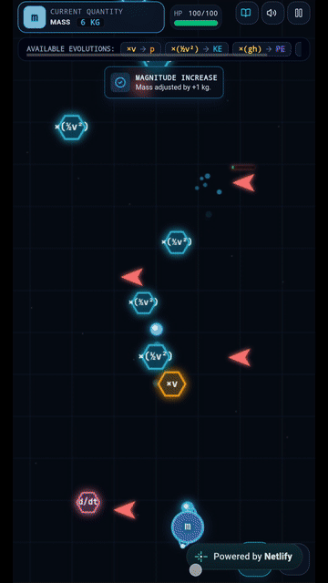
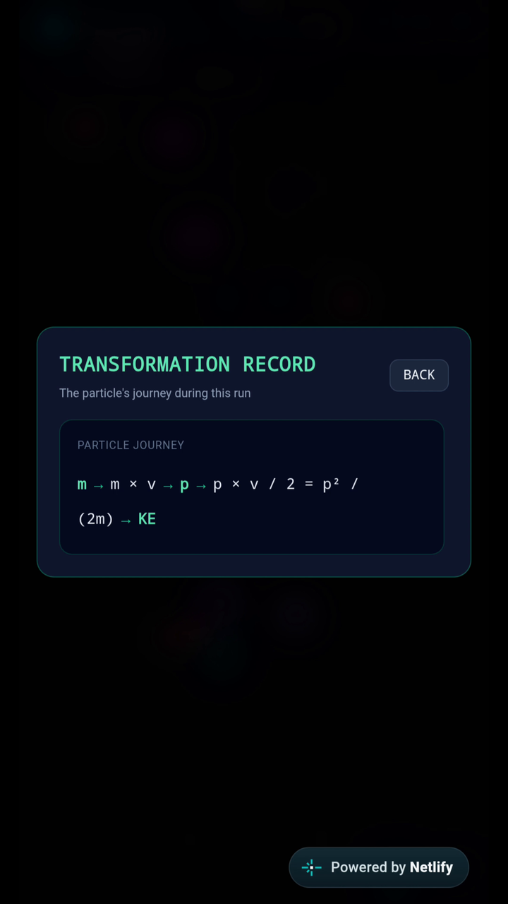

# Physics Evolution ⚛️🎮

**Physics Evolution** is an educational 2D game designed to help students understand how physical quantities can transform into other physical quantities through mathematical relationships.

Instead of simply memorizing formulas, the player learns physics concepts through gameplay, decision-making, and experimentation.

---

## 🎮 Play the Game

📱 **IMPORTANT: This game is designed primarily for smartphones and is meant to be played in portrait mode.**

For the intended gameplay experience, open the game on your **mobile phone**.

**[▶️ Play Physics Evolution](https://glowing-cranachan-ee7303.netlify.app/)**

> **Mobile recommended:** The game uses touch-based controls and is optimized for portrait orientation.


### ⚛️ Example Transformation

**Mass → Momentum**

The player combines mass with velocity to transform into momentum, changing the particle's firing pattern.




### 📖 Transformation Record

At the end of the run, the player can review the sequence of physical transformations.



---

## 🧠 How Does It Work?

The player starts with a physical quantity and encounters special symbols representing other quantities or mathematical operators.

The objective is to identify which quantities can create meaningful physics relationships and choose them during gameplay.

For example:

**Mass × Velocity → Momentum**

\[
p = mv
\]

When the player collects **v** while their current state is **m**, the state transforms into **momentum (p)**.

The transformation also changes the player's firing pattern, making the physics relationship part of the gameplay mechanics.

---

## ⚛️ Learn Physics Through Gameplay

The game treats physics formulas as a **transformation system**.

For example:

```text
m
↓ 
m × v
↓
p
